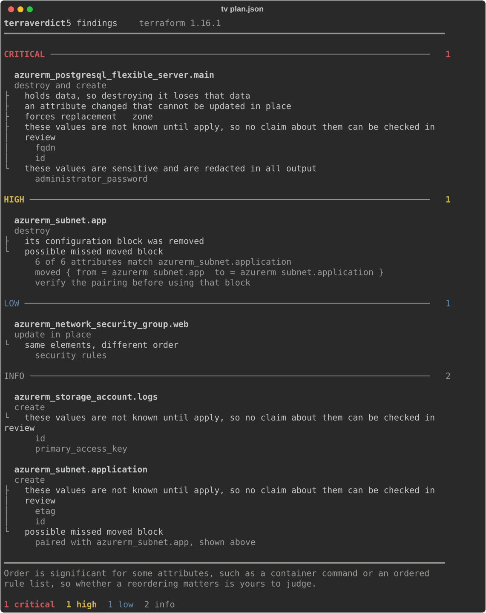

<p align="center">
  <picture>
    <source media="(prefers-color-scheme: dark)" srcset="assets/banner-dark.svg">
    
  </picture>
</p>

<p align="center">
  <a href="https://github.com/dbhq-uk/terraken/releases"></a>
  <a href="https://github.com/dbhq-uk/terraken/actions/workflows/ci.yml"></a>
  <a href="https://goreportcard.com/report/github.com/dbhq-uk/terraken"></a>
  <a href="LICENSE"></a>
</p>

`terraform plan` already knows the blast radius of your change. It just prints
it as several hundred lines of undifferentiated text, and the one line that
destroys your database looks exactly like the one that adds a tag.

Terraken ranks it.

<p align="center">
  
</p>

It reads a plan file and nothing else. No credentials, no network, no `apply`,
and it never prints an attribute's value - not even one Terraform forgot to
mark sensitive. It is deterministic: the same plan gives the same verdict, and
there is no model in the loop to talk you round.

## What it tells you

- **What this change destroys**, ranked, with the ones that lose data first
- **Why** a resource is being replaced, using Terraform's own stated reason
- **Which attribute** forced the replacement
- **Which way round the replacement happens** - whether the plan destroys the
  existing object before creating its replacement, or the other way about. The
  order is in the plan and it used to be thrown away
- **What this plan does before what** - which of the things depending on a
  destructive change are torn down ahead of it, and which are rebuilt after.
  Order, computed from a file, with no credentials involved
- **Renames that forgot a `moved` block** - a destroy and a create that look
  like the same resource, which is how an agent refactor quietly destroys a
  database it meant to keep
- **Attributes whose before and after are the same value written
  differently** - a reshuffled list, a JSON policy whose keys moved, a
  re-indented heredoc, a port that came back as a string, a null that became
  an empty list - each named by attribute path and by class, so you can tell
  a rewrite from a change at a glance and decide for yourself which it is
- **When that is the whole of a resource's change**, said out loud, which is
  the fastest way to clear an `update in place` that is really nothing
- **Credentials sitting in the plan file that Terraform did not mark
  sensitive** - by attribute path and by what they appear to be, never by
  value. See [the warning about plan files](#a-warning-about-plan-files)
- **What cannot be known until apply**, so you can see which claims about this
  change are unverifiable in review
- **Checks Terraform could not confirm** - including the ones that failed
  while planning, which Terraform reports as a warning and lets the plan
  succeed, so CI steps over them with exit 0
- **What changed underneath the estate**, which Terraform already found during
  refresh and wrote into the plan. Reported as its own list, never mixed with
  what this change proposes to do
- **How much of this change can be checked before it is applied**, and the
  part that cannot, with every reason named separately
- **What the plan says about itself** - whether planning errored, whether
  Terraform expects the state to match after applying, and whether it would
  make sense for an automation to apply it. Reported as fact, never ranked
- **Operations this build cannot read at all** - an action from a newer
  Terraform than the binary you are running. It is reported as unranked and
  named, rather than passed off as no change

## Install

    go install github.com/dbhq-uk/terraken/cmd/terraken@latest

Or download a binary from the releases page. The release ships both `terraken`
and `tken`; they are the same program, so use whichever name is free on your
machine.

**Every platform terraform runs on**, which is the rule rather than a list that
grew by accident: this tool reads what `terraform show -json` emits, so it has
no business claiming a platform terraform does not support and no excuse for
missing one it does.

| OS | Architectures |
|---|---|
| Linux | `386` `amd64` `arm` `arm64` `s390x` |
| macOS | `amd64` `arm64` |
| Windows | `386` `amd64` `arm64` |
| FreeBSD | `386` `amd64` `arm` |
| OpenBSD | `386` `amd64` |
| Solaris | `amd64` |

Windows archives are `.zip`; the rest are `.tar.gz`. The test suite runs on
Linux, macOS and Windows, which is every operating system GitHub hosts a runner
for. The other three are compile-checked on every push and nothing more - that
is a real limit, and it is stated rather than implied.

`tken` rather than anything shorter, because the three obvious candidates all
belong to somebody else: `tk` is Tcl/Tk, `tkn` is the Tekton CLI, and `kn` is
the Knative CLI, which even has a Homebrew formula of that name. Both of the
latter are CI/CD tools, so they share this one's audience. Installing us must
not shadow a command you already rely on.

## Use

    terraform plan -out tfplan
    terraform show -json tfplan > plan.json
    terraken plan.json

Or pipe it, and never write the plan to disk at all:

    terraform show -json tfplan | terraken -

For example, a plan that replaces a database because of an attribute that
cannot be updated in place:

    terraken  1 finding  terraform 1.9.8
    ━━━━━━━━━━━━━━━━━━━━━━━━━━━━━━━━━━━━━━━━━━━━━━━━━━━━━━━━━━━━━━━━━━━━━━━━

    CRITICAL ───────────────────────────────────────────────────────────  1

      azurerm_postgresql_flexible_server.main
      destroy, then create
      ├ holds data, so destroying it loses that data
      ├ an attribute changed that cannot be updated in place
      ├ forces replacement   zone
      └ destroyed before the replacement is created

    ━━━━━━━━━━━━━━━━━━━━━━━━━━━━━━━━━━━━━━━━━━━━━━━━━━━━━━━━━━━━━━━━━━━━━━━━
    1 critical

One section per severity present, most severe first, and none at all for a
severity with nothing in it. The report is set to the width of your
terminal, between 60 and 100 columns.

## In CI

    terraken --format md plan.json >> "$GITHUB_STEP_SUMMARY"
    terraken --fail-on critical plan.json

`--fail-on` is off by default. Adopt it read-only first.

There is a GitHub Action in this repository that does both in one step:

    - uses: dbhq-uk/terraken@v0.9.0
      with:
        plan: plan.json
        fail-on: critical

It writes the markdown report to the job summary and uses the same run's
exit code as the gate, so the summary and the verdict cannot disagree.

## The gate, for agents and pipelines

Agents write Terraform now, and nothing independently checks what they
produced. `--format gate` is a machine-first verdict: what the answer is, what
is blocking it, and where.

    terraken --format gate --fail-on critical plan.json

```json
{
  "schema": "terraken.gate/v1",
  "verdict": "fail",
  "threshold": "critical",
  "counts": { "critical": 1, "low": 4, "info": 1 },
  "blocking": [
    {
      "address": "azurerm_postgresql_flexible_server.main",
      "type": "azurerm_postgresql_flexible_server",
      "level": "critical",
      "kind": "replace",
      "data_loss": true,
      "replace_order": "destroy-before-create",
      "reasons": ["holds data, so destroying it loses that data"],
      "paths": ["zone"],
      "depends": ["azurerm_subnet.app"]
    }
  ],
  "exposure": [
    {
      "address": "(root variables)",
      "path": "cloudflare_api_token",
      "looks_like": "an attribute named as a secret, not marked sensitive",
      "confidence": "pattern matching: this misses credentials it does not recognise, and names values that are not credentials"
    }
  ],
  "status": { "errored": false, "complete": true, "applyable": true },
  "coverage": {
    "changes": 6,
    "assessed": 5,
    "gaps": [
      {
        "code": "unknown-until-apply",
        "detail": "1 of 6 changes carry values Terraform will not know until it applies them, so no claim about those values can be checked now",
        "count": 1,
        "of": 6
      }
    ],
    "headline": "5 of 6 changes could be assessed in full, and the note below is what the rest of this plan does not say"
  },
  "unsupported": [
    {
      "address": "terraform_data.reconciled",
      "type": "terraform_data",
      "actions": ["\"reconcile\""],
      "detail": "this build does not recognise the operation this plan asks for, so its impact cannot be assessed and nothing below it was ranked"
    }
  ]
}
```

**This is a contract, and it is versioned separately from the tool.** Within
`terraken.gate/v1`:

- Fields are only ever **added**. A parser that reads what it knows and ignores
  the rest keeps working.
- `verdict` is only ever `pass` or `fail`. A new state gets a new field, never a
  third value here, because a caller comparing against `fail` must not start
  silently passing.
- Removing or repurposing a field is a `v2`, and `v1` keeps being emitted for at
  least one minor release after `v2` appears.
- **The human report's shape is not part of this contract** and may change
  freely. That separation is the whole point of the mode existing.

`paths` holds attribute paths; `depends` holds resource addresses from the blast
radius. They are separate fields because they answer different questions and a
parser cannot tell them apart by looking.

`caveats` carries the standing limits on that entry's `reasons` - one per
annotation that has one. The human report lifts those into a footer and says
each once; the gate has no footer, so every entry repeats its own, like
`exposure` does with `confidence`. An entry lifted into a log line cannot
arrive without the limit on it.

`destroyed_first` and `changed_after` are the resources this plan orders around
a destructive change, and they are resource addresses rather than attribute
paths, so they get their own fields for the same reason `depends` does. Order
only: no window, no duration, and independent steps are not ordered against each
other at all.

`replace_order` is `destroy-before-create` or `create-before-destroy`, and it is
absent on anything that is not a replacement. **It does not move the verdict or
the level** - both orderings destroy the old object, so both are the same
severity. What differs is the order of the two steps, and that is all it says -
it is not a claim that the resource is there throughout. Stop on a destroy that
precedes its replacement with
`.blocking[] | select(.replace_order == "destroy-before-create")`, which is your
policy and one line.

`exposure` is what the plan **file** is carrying, and it is omitted when there
is nothing - test `(.exposure // []) | length`, never presence. **It does not
move the verdict.** `verdict` answers one question, whether anything reached the
threshold, and the threshold is a severity level, which this is not; a heuristic
that could fail a build on its own would fail one nothing in the plan justified.
Branch on the array if you want to stop on it. Every entry repeats its own
`confidence`, so an entry lifted into a log line cannot arrive without the
caveat.

`unsupported` is every operation this build could not recognise, and it is the
field that says the verdict above is incomplete. Those findings have no
severity - the tool does not know what the operation does, so it cannot rank it
- which means they cannot reach a threshold and do not move the verdict. Read
this array as well as `verdict`, or a `pass` will tell you the plan is clear
when part of it was never read. Like `exposure` it is carried whether or not a
gate was asked for, and it is omitted when there is nothing: test
`(.unsupported // []) | length`.

`coverage` is how much of the plan could be checked before apply. It does not
move the verdict either: not knowing something is not a severity, and a plan
the tool could only half read may still hold nothing at or above the threshold.
Test `.coverage.gaps | length == 0` if you will not act on a partial
assessment.

`status` is what the plan says about **itself**, and every key is always
present with three possible values: `true`, `false` and `null` for a plan that
did not state it. Terraform has emitted `errored` since v1.7 and `complete` and
`applyable` since v1.8, so a plan can genuinely state some and not others; an
older plan, or OpenTofu, may state none. "This plan does not converge" is a
different fact from "this build could not tell", and `null` is how you tell
them apart.

**It does not move the verdict either.** None of the three is a severity. An
errored plan is not a resource change, and a clean no-op plan is deliberately
*not* applyable - anything treating that as risk would fail the plan that most
deserves to pass. Test `.status.errored == true` if you want to stop on one;
that is your policy and one line.

**The threshold comes from the invocation and nothing else.** `--fail-on` sets
it, nothing in the plan can reach it, and `--min-level` does not apply - turning
the human report's volume down must never talk the gate into passing.

**It never proposes a change.** The reasons name what failed and where. A gate
that tells an agent how to get past it is a gate that has been talked past.

There is no model here, no MCP server and nothing that talks to one. This is the
fence, not the animal.

## Your own rules

Teams have rules a plan must obey - never destroy anything tagged production,
never replace a bucket outside a maintenance window. Enforcing those normally
means a policy engine with its own language and runtime, or a reviewer
remembering.

    terraken --rules rules.json plan.json

A rule file is JSON, and a rule matches on what the tool has already worked out:

```json
{
  "rules": [
    {
      "id": "no-prod-destroy",
      "message": "production resources must not be destroyed",
      "level": "critical",
      "when": {
        "actions": ["delete", "replace"],
        "types": ["aws_db_*"],
        "path_equals": { "tags.Environment": "production" }
      }
    }
  ]
}
```

Conditions are `actions`, `types`, `modules`, `level_at_least`, `data_loss`,
`path_present`, `path_absent` and `path_equals`. Everything set must hold; there
is no `or`, because two rules say it better - each carries its own id and
message, so the report tells you which one fired.

`actions` also accepts `unsupported`, which is how you make a plan this build
could not read stop a pipeline:

```json
{
  "id": "unreadable-plan",
  "message": "terraken could not assess this operation, so this plan has not been reviewed",
  "level": "critical",
  "when": { "actions": ["unsupported"] }
}
```

The rule gives the finding a severity it does not otherwise have, so `--fail-on`
can see it. Going through a rule is deliberately the only route: a team pinned
to `--fail-on critical` should not start failing the day Terraform ships an
action verb their binary has never seen, and a decision this large belongs in a
file somebody committed.

Giving one a severity does not make the operation understood, so it stays in
the gate's `unsupported` array and stays visible under every `--min-level`,
whatever level the rule assigned.

**A rule may test a value without the value reaching the output.** `path_equals`
compares internally and the finding names only the path. That is what lets this
exist at all without breaking the tool's one guarantee.

**A rule file that does not load stops the run**, with exit 2 and a message
naming the rule and the problem. A typo'd field is an error rather than a
condition that quietly never matches - the second is how a team believes they
are covered for a year. Exit 2 is "the tool could not do its job"; exit 1
remains "the plan failed your gate".

Findings from your rules carry your message and your severity, and are marked
as yours rather than the tool's judgement. Where several rules match one
resource, the highest severity wins.

This is not a policy language and must not become one. There is no expression
syntax and no user-supplied code. The moment it needs a parser it has become a
worse version of a tool that already exists.

## Proposing the moved blocks

When a plan destroys one resource and creates another that looks like the same
thing, `--moved` writes the block you needed:

    terraken --moved plan.json

    # Proposed by terraken from a plan file.
    #
    # VERIFY EACH PAIRING BEFORE APPLYING. These are inferred from attribute
    # similarity, not from any record of what you intended. A moved block naming
    # the wrong resource adopts a decommissioned object's state under a live
    # address, which is worse than the missing block it fixes.

    # 5 of 5 compared attributes identical.
    moved {
      from = azurerm_subnet.app
      to   = azurerm_subnet.application
    }

Redirect it into a `.tf` file. Everything that is not a block is a comment, so
the whole output is valid HCL - verified in the tests with the same parser
terraform uses, and the sample above passes `terraform validate` and
`terraform fmt -check`.

**It refuses when it cannot tell.** If two creates match the deleted resource
equally well, no block is emitted for that pairing. Instead it says so and
names both candidates, because a block is copy-pasteable in a way a warning is
not, and picking by alphabetical order is not evidence.

It writes to stdout, or to `--out <path>`. It never edits a file you did not
name.

## How it compares

There are good tools either side of this one, and it is worth being plain
about where the line falls.

**[tfautomv](https://github.com/busser/tfautomv)** (900 stars) inspects a plan,
finds create/delete pairs left by a refactor, and *writes the `moved` blocks
into your configuration for you*. If you are the person doing the rename, use
it - it fixes the problem rather than reporting it.

`--moved` narrows that gap but does not close it, and the remaining difference
is the point. Terraken emits the block to stdout or to a path you name, and
never edits a file you did not ask for; tfautomv is a refactoring tool and this
is a review tool that happens to be able to show you its working. It also
**refuses where tfautomv chooses**: two creates matching the deleted resource
equally well produce a stated refusal naming both, rather than a block picked
by the tiebreak. That is the right call for something read in a pull request
and the wrong one for something run by the author, who knows which they meant.

**[tfmv](https://github.com/suzuki-shunsuke/tfmv)** renames resources and
generates `moved` blocks, so the same distinction applies.

**[tfplan2md](https://github.com/oocx/tfplan2md)** turns a plan into a readable
markdown report for pull request review, groups by module, shows semantic
diffs on lists and masks sensitive values. It overlaps with this tool and it
is good at what it does. The difference is what the output is *for*:
tfplan2md makes a plan **readable**, and Terraken makes it **ranked** -
it sorts by how much damage a change can do, escalates to critical when the
resource holds data, and gives you `--fail-on` so a pipeline can stop on it.

There is also a wide field of "AI-powered Terraform plan risk" projects. This
is not one of them. There is no model in the loop, nothing is sent anywhere,
and the same plan always produces the same verdict.

**The one guarantee none of the above makes:** Terraken never prints an
attribute's value, in any format. Not a masked one, not a redacted one - it
does not put values in its output at all. Masking relies on Terraform having
marked the value sensitive, and the section below on plan files is there
because a live credential was found in a real plan that Terraform had not
marked. Paths, counts and its own sentences are all this tool will ever show
you.

## Flags

| Flag | What it does |
|---|---|
| `--format terminal\|md\|json\|html\|gate` | Output format. Default `terminal`. |
| `--out <path>` | Write the report to a file instead of standard output. Works for every format. |
| `--fail-on critical\|high\|low\|info` | Exit 1 if any finding reaches this level. Off by default. |
| `--min-level critical\|high\|low\|info` | Only show findings at this level or above. Shows everything by default. `unranked` findings are always shown. |
| `--plain` | No colour, and ASCII only - no box drawing anywhere in the output. |
| `--no-colour`, `--no-color` | Never colour terminal output. |
| `--rules <path>` | Evaluate your own rules from a JSON file alongside the built-in findings. |
| `--moved` | Instead of the report, print the `moved` blocks this plan looks like it forgot, as HCL. |
| `--version` | Print the version and exit. |

Colour is only used when output is going to a terminal. Setting
[`NO_COLOR`](https://no-color.org) to anything non-empty switches it off
too, and `FORCE_COLOR` turns it back on when the destination is a pipe -
a CI log that renders ANSI, or a pager held open with `less -R`. `NO_COLOR`
wins if both are set, because turning colour off should never be the
setting that loses. `--plain` goes further and also drops the box-drawing characters, for
a pipeline, a log viewer, or a console that renders them badly:

    terraken --plain plan.json

    terraken  1 finding  terraform 1.9.8
    ========================================================================

    CRITICAL ------------------------------------------------------------  1

      azurerm_postgresql_flexible_server.main
      destroy, then create
      |- holds data, so destroying it loses that data
      |- an attribute changed that cannot be updated in place
      |- forces replacement   zone
      `- destroyed before the replacement is created

Flags go before the file: `terraken --format md plan.json`.

### Writing the report to a file

`--out` sends the report to a path and prints one line naming it, so
nothing else lands on standard output:

    terraken --format html --out report.html plan.json
    wrote report.html

The file is created mode 0600 **on Unix**. The report names every resource in
the plan, which on a shared runner is a map of the estate; widen it yourself if
you want to. Colour is never written to a file, whatever terminal the command
was launched from.

On Windows the mode is not applied - NTFS has no Unix permission bits, so Go
ignores the argument and the file inherits the directory's ACLs. That is worth
knowing before writing a report to a shared Windows runner, and it is stated
here rather than left for somebody to discover.

### The HTML report

`--format html` writes one self-contained document: inline CSS, no
external stylesheet, no font, no image, no script. It opens from a
`file://` URL with nothing else on disk, and it follows
`prefers-color-scheme`, so it reads the same way in a dark editor as in a
light browser.

It is meant for a review you want to send to someone, or keep beside a
change. It carries exactly what the terminal carries - no attribute value
has ever reached any of these formats, and none reaches this one.

### Turning the volume down

A 90-resource plan runs to a few hundred lines, most of it `update in
place` stanzas that say nothing else. Ranking sorts that problem; it does
not remove it. `--min-level` does:

    terraken --min-level high plan.json

    ━━━━━━━━━━━━━━━━━━━━━━━━━━━━━━━━━━━━━━━━━━━━━━━━━━━━━━━━━━━━━━━━━━━━━━━━
    4 critical  60 low  26 info               86 below high not shown

The summary always counts the whole plan and always says how much is
hidden. `--min-level` changes what you read, never what was found, and
never the exit code - `--fail-on` is measured against every finding, so
turning the volume down cannot turn a gate off.

The same filtering applies to `--format json`: `findings` holds only what
qualified, `counts` always stays complete and unfiltered, and `hidden` /
`hidden_below` are omitted entirely on an unfiltered run, so a consumer
should read `.hidden // 0` rather than assume the key exists.

### Which way round a replacement happens

A replacement is two operations, and Terraform states in the plan which order it
will carry them out in. Terraken used to throw that away and call both
"destroy and create", which is the right words in the wrong order for half of
them:

    terraform_data.service
    destroy, then create
    └ this plan destroys the existing object before creating its replacement

    terraform_data.service
    create, then destroy
    └ this plan creates the replacement before destroying the existing object

Both are `replace`, both are the same severity, and the gate carries the
distinction under `replace_order` as `destroy-before-create` or
`create-before-destroy`.

**It does not change the level, and that is deliberate.**
`create_before_destroy` changes the order; it does not stop the old object being
destroyed, and on a resource that holds data the data still goes. A report that
dropped a database's replacement from critical to high because the new one
appears first would be wrong about the thing that matters most.

**It is the order, not a promise about availability.** `create-before-destroy`
does not mean the resource is there throughout. A `local_file` with a fixed
filename planned that way ends the apply with the file **deleted**: Terraform
writes it for the new object, then the old object's destroy removes that same
path. That was run rather than reasoned about, and it is why the sentence names
the sequence and stops. Whether the thing the two operations act on survives is
a question about the provider, and the plan does not answer it.

**Terraken reports the order and never the cause.** The obvious sentence is
"`create_before_destroy` is set", and it would be a claim the plan does not
support. The `lifecycle` block is not in plan JSON at any point - neither is
`prevent_destroy` or `ignore_changes` - so the order of the `actions` array is
the whole of what can be known. The rule also propagates down the dependency
chain, so a resource that never sets it is planned this way because something
downstream of it did. Both cases are committed as fixtures generated by real
Terraform.

### What this plan does before what

Blast radius answers "what else depends on this". The next question is *when*,
and the same graph plus the change set answers it:

    terraform_data.base
    destroy, then create
    ├ 2 resources in this plan depend on it, 1 directly
    │   terraform_data.middle
    │   terraform_data.leaf
    ├ this plan destroys 2 resources that depend on it before destroying this
    │ one
    └ this plan creates or updates 2 resources that depend on it after creating
      this one

Two claims, reported separately, and terraken makes no others:

- a dependant is **destroyed before** this resource is destroyed
- a dependant is **created or updated after** this resource is created

They are stated as two sentences rather than one because each is anchored to a
different step of this resource. A single sentence saying the dependants go
first and come back afterwards would assume this resource's destroy precedes
its own create, and under `create_before_destroy` it does not - the creates run
first. The second claim is also only made where this resource is itself
created: a plan that only destroys something has no create for anything to
follow.

Both are Terraform's own ordering, and both were checked by running it rather
than by citing it. A three-resource chain applies as `leaf.destroy`,
`middle.destroy`, `base.destroy`, `base.create`, `middle.create`, `leaf.create`
- the whole chain torn down before any of it is rebuilt, so the resource
furthest from the change is destroyed first and rebuilt last. The roots and the
observed output are committed in `testdata/_gen`.

The gate carries the two lists under `destroyed_first` and `changed_after`.

**It is silent where the graph cannot see.** `depends_on` is not in the plan's
`expressions`, and a resource expanded by `count` or `for_each` is named by its
configuration address there and by an instance address in the change set, so
neither reaches this. That is
[#57](https://github.com/dbhq-uk/terraken/issues/57), it affects the blast
radius as much as the ordering, and until it is fixed the printed caveat says
so.

**There is no outage window here, and that is deliberate.** The issue that
asked for this offers "six resources depend on this and cannot be reached until
it is recreated" as a fact the tool may state. It is not one. "Cannot be
reached" is a claim about the world, and the plan states the order of
operations and nothing about whether a provider's destroy takes the thing away
- the same `local_file` counterexample that shaped
[the replacement ordering](#which-way-round-a-replacement-happens) applies here.
So terraken gives you the order and you draw the conclusion, from something
that is actually in the file.

Two limits are printed with it, because they are part of the claim. The graph
is what the configuration **declares**, so a dependency nobody wrote down
orders nothing. And Terraform walks independent steps at the same time, so this
is the order it has to respect rather than a timeline.

### When it cannot read the plan at all

A plan can carry an action this binary has never seen - a newer Terraform, a
newer OpenTofu, a shape the format did not have when this version was built.
Terraken says so:

    terraken plan.json

    UNRANKED ───────────────────────────────────────────────────────────  1

      terraform_data.reconciled
      operation this build does not recognise
      └ terraken cannot assess this operation
          "reconcile"

`unranked` is not a fifth severity. It is the absence of one: the tool does not
know what the operation does, so it has nothing to rank, and saying `info`
would be a guess dressed as a measurement. It is counted apart from
`critical`/`high`/`low`/`info` for the same reason, and it appears in its own
tally on the summary line.

Three consequences, all of them deliberate:

- **It sorts first**, above critical, because it is the one finding that says
  the rest of the report is incomplete.
- **No `--min-level` can hide it.** Turning the volume down cannot turn this
  off.
- **`--fail-on` never sees it**, because `--fail-on` takes a severity and this
  has none. Make it stop a pipeline with [a rule](#your-own-rules), or branch on
  the gate's `unsupported` array.

The action names are Terraform's own vocabulary, taken from the plan and quoted
so a plan file cannot recolour or reflow the report that reads it. No attribute
value is involved, here as everywhere else.

### Same elements, different order

A lot of what a plan shows as changed is a list that came back in a
different order. Providers return sets as JSON lists, and
`service_endpoints`, `address_prefixes`, `cidr_blocks`, `subnet_ids`,
`vpc_security_group_ids` and `availability_zones` all reshuffle themselves
without anyone touching the configuration. Terraform renders a diff, and a
reviewer reads a change.

For an update or a replacement, terraken says when a changed list holds
the same elements in a different order, and names the attribute:

    aws_db_instance.main
    destroy, then create
    ├ holds data, so destroying it loses that data
    ├ an attribute changed that cannot be updated in place
    ├ forces replacement   instance_class
    ├ destroyed before the replacement is created
    └ these lists hold the same elements in a different order. Order is
      significant for some attributes, such as a container command or an
      ordered rule list, so whether this one matters is yours to judge
        vpc_security_group_ids

**It is a fact, not a verdict.** It does not say the change is harmless and
it does not move the finding's level. Order is significant for plenty of
attributes - a container's `command` or `entry_point`, an
`aws_lb_listener_rule`'s actions, a route table, a WAF rule list - and
reordering any of those changes what the infrastructure does. terraken
has no way to know which attribute you are looking at, so it reports what
it saw and leaves the call to you. A tool that announced "no semantic
change" would eventually say it about somebody's container command, and it
would be wrong.

The comparison counts duplicates, so `["a","a","b"]` and `["a","b","b"]` are
not the same list and are not reported. Elements are compared by their JSON
encoding, so the number `15` and the string `"15"` stay different things. A
list that is unchanged is not reported either, and neither is one Terraform
cannot know until apply.

### The same value, written differently

A reshuffled list is one of several ways a plan shows an attribute as
changed when the two sides are the same thing written differently.
terraken names four more, on exactly the same terms:

| Class | What it found |
|---|---|
| `same-json-written-differently` | Both sides parse as JSON and hold the same data, with the keys in a different order. This is the big one: IAM and bucket policies, `aws_ecs_task_definition.container_definitions`, anything a provider round-trips as a JSON blob |
| `same-text-different-whitespace` | Both sides are the same text laid out differently: a trailing newline, an indent, a CRLF against an LF. Heredocs, policy documents, `user_data` |
| `same-number-written-differently` | Both sides are the same number written another way: `80` and `"80"`, `1e3` and `1000`. Providers are inconsistent about number against string |
| `null-on-one-side-empty-on-the-other` | One side is null and the other is an empty list, object or string. State is full of this |

    terraken plan.json

    aws_security_group.web
    update in place
    ├ same elements, different order
    │   ingress[0].cidr_blocks
    ├ same number, written differently
    │   ingress[0].from_port
    │   ingress[0].to_port
    └ every attribute this plan shows as changed here is a difference in how the
      value is written

**Every one of these is a fact, not a verdict**, for the same reason a
reordering is. Each class has a case where the difference is real, and the
report says so rather than deciding for you:

- A JSON document with its keys moved is the same policy, but a consumer
  that compares the string byte for byte sees a change.
- Whitespace is significant in a `user_data` script, in a YAML document
  carried as a string, and in anything hashed.
- `80` and `"80"` differ in type, and a type change can matter.
- `null` and `[]` are not the same to Terraform in every position, where
  null can mean "inherit a default" and empty means "explicitly none".

None of them moves a finding's level, and none of them says the change is
harmless.

#### The roll-up

The last line above is the useful part. When **every** attribute the plan
shows as changed on a resource is one of these classes - a reordering
included - terraken says so on that finding:

    every attribute this plan shows as changed here is a difference in how the
    value is written

That is still a statement of fact, and it is the single most useful thing
this tool can tell you about an `update in place` that is really nothing.
"Not in what it is" names the kind of difference each attribute fell into,
and it is not a ruling that the change is harmless: order is significant for
a container command, whitespace is significant in a script, and the roll-up
fires over both. It says what kind of difference each one is and rules on
none of them, and it never moves a finding's level.

It is a strict claim, so it is made strictly. One real change alongside four
rewrites and the roll-up stays quiet - the per-attribute lines are all still
reported, because each of them is still true, but the sentence about the
whole resource would not be. An attribute that cannot be compared at all
silences it too: something the plan shows as changed but that is not known
until apply cannot be accounted for, so the roll-up does not speak for that
resource.

Each class is reported once per attribute and never twice. Where a pair
satisfies more than one, the narrowest claim wins - a JSON document with a
trailing newline is reported as whitespace, not as JSON, because "the only
difference is whitespace" says more than "the data matches". A path the
reordering rule has already claimed is never reported again here.

## What it does not do

It takes a file, or a piped stream. It never runs `terraform`, never reads
your cloud credentials, never makes a network call, and never applies
anything. It writes one file, and only the one you name with `--out`.
Sensitive values are redacted and there is no flag to turn that off.

It does not model consequences, validate against provider schemas, check
policy, or estimate cost. Other tools do those.

## A warning about plan files

Treat plan JSON as a secret. While building a test fixture for this project,
a real `terraform show -json` of a live estate turned out to contain a live
credential - a Cloudflare Tunnel token - sitting in plain text, which
Terraform had not marked `sensitive`.

Terraform's own `sensitive` marking is best-effort: it only redacts an
attribute that a provider schema or your configuration told it to redact, and
provider schemas are not exhaustive. A plan file can contain anything state
can contain, in the clear, whether or not anything marked it.

terraken never prints an attribute's value at all, marked or not, which is
what makes it safe to point at a plan nobody has vetted. Never paste a plan
file into an issue, a chat, or anywhere outside a private, access-controlled
pipeline.

### The guarantee is proved on every build, not asserted

Every tool in this space promises something about secrets, and a reader has no
way to tell the promises apart. So this one is measured rather than stated.

On every commit, CI generates plans carrying planted credentials - AWS access
key ids, GitHub tokens, PEM private key blocks, connection strings with the
password in them, JSON Web Tokens, high-entropy secrets - in 28 different
positions a value can occupy in a plan file. A top-level attribute, an object
nested inside an object, an element of an array, a JSON document carried as a
string, the `before` side of a destroy, a value beside an unknown sibling, a
value beside one Terraform *did* mark, the values the reorder and rewrite rules
compare, a resource inside a module, the attribute that forced a replacement, a
root variable, an output on either side, `planned_values`, `prior_state`,
`resource_drift`, `checks`, `deferred_changes`, a constant in the
`configuration` block, a resource identity, and the child-module trees of
several of those.

**None of them is marked `sensitive`**, because that is the whole point: the
guarantee cannot rest on Terraform's marking, and a live credential has already
been found in a real plan that Terraform had not marked.

Every generated plan is then run through every output the command can produce -
each `--format`, with colour and without, with `--plain`, with `--min-level`
filtering, with `--fail-on` set, written to a file with `--out`, and through
`--moved`, which emits HCL somebody redirects straight into their
configuration. Standard error is checked too, and so is anything written
directly to the process's own streams, because a leak does not become safe by
going out of a different pipe.

The check is not a plain substring search. Before comparing, both sides have
whitespace removed, case folded, ANSI escape sequences stripped, HTML tags
stripped and backslashes dropped - so a token wrapped across two terminal
lines, re-indented inside a JSON document, upper-cased into a heading, split by
a colour change or a `<span>`, or carrying JSON escapes is still one run. Any
run of 12 characters counts, so half a credential is a failure.

The run is seeded and reproducible, and it states its own size:

```
leak proof: 168 generated plans, 28 positions (17 of them read by this build),
6 credential shapes, 3360 rendered outputs, seed 20260917 -
no run of 12 or more characters of any planted secret reached any of them
```

**Read that sentence exactly as it is written.** It is a bounded property, not
a proof of the whole guarantee: a disclosure shorter than twelve characters, or
a length derived from a value, would pass it. Eleven of the 28 positions are
not read by this build at all, so their cases prove nothing yet - that is
recorded in the test rather than folded quietly into the total, and the build
fails the day a feature starts reading one, by which point the proof is already
waiting for it.

The detector has its own test, because "we ran a lot of cases and none failed"
is exactly the claim that needs evidence: it is checked against a value printed
outright, wrapped across lines, re-indented, upper-cased, and half printed, and
against outputs that legitimately carry the attribute path but not the value.
The whole harness has been checked by sabotage as well - an annotation made to
quote the values it describes, a credential class made to name a prefix of what
it found, and a value pushed through to every renderer - and each one turns the
build red and names the position it escaped from.

## The failure your pipeline is stepping over

A `check` block that fails while planning is reported by Terraform as a
**Warning**, and it does not fail the plan by itself. So a failure somebody
wrote down as mattering goes past without anything downstream having to notice
it.

    CHECKS TERRAFORM COULD NOT CONFIRM ─────────────────────────────────  1

      check.budget_is_set
      check block   fail
      └ this check failed while planning. Terraform treats an assertion
        failure as a warning, so it does not fail the plan by itself and
        nothing downstream has to notice it. The message is in the plan output

Resource conditions are reported the same way, with the instance address where
there is one - `terraform_data.app["production"]`
rather than `terraform_data.app`. Checks that could not be determined before
apply are reported too, because not knowing is exactly the kind of thing this
tool says out loud. Passing checks are not: a report listing everything that
went right is one nobody reads to the end.

**The message is never printed, and this is not fussiness.** `error_message` is
written by whoever wrote the configuration and Terraform *interpolates* it. A
plan generated while building this carried a live GitHub token in a check's
failure message. Printing it would put an attribute value in the output, which
is the one thing this tool does not do - so the report names the check and what
its status means, and you read the message in the plan output, where you
already have it.

It does not fail the gate on its own either. Terraform treats it as a warning;
if you disagree, branch on the gate's `checks` array.

Terraform's own documentation marks the JSON representation of checks as
experimental, so the shape may change. Everything above was established from
real `terraform show -json` output rather than from the specification alone,
and the fixtures are committed.

## What changed underneath, without asking a cloud

Terraform computed this during refresh and wrote it into the plan file.
Reading it needs no credentials, no network and no cloud API - every other tool
that reports drift needs all three, and this one needs none of them because the
answer is already in the artefact.

    CHANGED OUTSIDE TERRAFORM ──────────────────────────────────────────  1

      azurerm_mssql_database.records
      CRITICAL   gone
      ├ this type holds data, so losing it loses that data
      └ destroyed outside Terraform

**The two lists never mix.** One is what somebody did, the other is what will
happen, and the verbs are the same words - "destroy" in the findings means
Terraform will destroy it, and here it means it is already gone. So drift gets
its own section in every format, its own array in the machine ones, and its own
past-tense verbs. The severity is printed on each entry rather than taken from
the heading, because there is only one heading.

It is ranked by the same rules as a planned change and **counted by none of
them**. It is outside the severity counts and `--fail-on` cannot see it, because
stopping a deploy cannot fix something that already happened. Branch on the
gate's `drift` array if you want to act on it.

Three things it is careful about:

- **Not every entry is external change.** Terraform puts a no-op entry in the
  same array when an object moved to a different address in state - a `moved`
  block, a renamed module - and reporting that as somebody editing
  infrastructure by hand would be a false alarm about the one thing this
  section exists to raise real alarms about.
- **`relevant_attributes` says "may have", not "did".** It names the resource
  and not which attribute, so the report says this plan reads the resource and
  the change may have affected the result. It does not claim it did.
- **An empty `resource_drift` is not reassurance.** Terraform writes it only
  when something drifted, so nothing recorded means either nothing drifted or
  refresh never ran. That silence is named by the coverage report above.

## How much of this can you actually check

Every other tool in this space renders the plan in more detail. A section
saying what the report **cannot** show you is the opposite of what a renderer
is for, and it is the question a reviewer actually has before approving.

    HOW MUCH OF THIS COULD BE CHECKED ──────────────────────────────────  5

      1 of 2 changes could be assessed in full, and the 5 notes below are what
      the rest of this plan does not say

      1 of 2 changes carry values Terraform will not know until it applies
      them, so no claim about those values can be checked now

      this plan does not record whether anything changed underneath the estate.
      Terraform omits that when refresh was skipped, so nothing drifting and
      nobody looking are indistinguishable here

Five separate silences in five different fields are the same fact, and each is
named on its own because they are different kinds of not-knowing:

| What | Where it comes from |
|---|---|
| Values Terraform will not know until it applies them | `after_unknown` on a resource change |
| Outputs whose value is not known until apply | `after_unknown` on an output change |
| Operations this build cannot read at all | an action outside the recognised vocabulary |
| Whether anything drifted underneath the estate | nothing recorded in `resource_drift` |
| That this plan is not the whole change | `complete: false` |
| Checks that could not be determined before apply | `checks` instances with status `unknown` |
| Work Terraform has already postponed | `deferred_changes` |

The drift one is the subtle one. Terraform writes `resource_drift` only when
something actually drifted, so a plan from a clean refresh and a plan from
`-refresh=false` are identical here: **nothing recorded means either nothing
drifted or nobody looked, and the file does not say which.** The first version
of this believed an empty array proved refresh had run, which would have been a
useful distinction if it existed, and would have had the report confidently
telling you your estate had not moved when nobody had checked.

**Every denominator is named, because they are not the same denominator.** A
resource change and an output change are different things and are counted
separately; a check with no instances is not one checked object, because
Terraform emits that both when expansion found zero objects and when it could
not work out how many there are.

**Counts with a named denominator, never a percentage.** "62% reviewable" is a
verdict wearing a number, and this report states facts rather than ruling. It
is also said the other way round: a plan with nothing hidden gets one line
saying so, because a reader who sees no coverage section cannot tell whether
everything was checkable or whether the tool did not look.

It counts the whole plan, so `--min-level` cannot change it, and it does not
move the gate: not knowing something is not a severity.

## The second guarantee: a report cannot be made to lie

The first guarantee is that nothing comes out. This one is that nothing gets
in.

A resource address carries a `for_each` key chosen by whoever wrote the
Terraform. On a fork pull request that is not somebody you trust, and terraken
prints those addresses - into your terminal, into a PR comment, into an HTML
file you send someone. The attack is not defacement, it is **reviewer
deception**: a table that grew a row saying `CLEAN | create`, a terminal
repainted to look like nothing is wrong, a line reversed by a right-to-left
override so it reads as a different resource. A report that can be made to say
something other than what the plan does is worse than no report, because it is
the thing being trusted.

So everything taken from a plan is untrusted input, in **every** format, not
only HTML. Control characters, escape sequences and the Unicode format
characters that reorder or hide text are turned into visible escapes before any
renderer sees them - `\x1b`, `\u202e` - and each format then escapes for its own
context: HTML entities, a markdown table cell, and code spans and fences chosen
long enough that their own contents cannot close them.

They are **shown, not stripped**. `app["a"]` and `app["a\u202e"]` are
different resources and must not render identically, and a report that quietly
deleted part of an address would be doing the deceiving itself.

This is tested the same way the value guarantee is. Every hostile fragment and
every **ordered pair** of them - an escape sequence, a table row, a code fence,
a link, a script tag, a bidirectional override, bytes that are not UTF-8 at
all, 1,122 payloads in total - goes through every format, and the assertion is
about the **structure** of the output rather than the absence of a character:
table rows, the number of cells in each row, `<details>` elements, severity
banners, tree connectors and the gate's own verdict all have to match what the
same report produces when it is harmless. Pairs are enumerated rather than
sampled because nearly every real attack is one, and random sampling was tried
first and missed two.

`--moved` is the exception that proves the rule, and it is handled differently
on purpose. It emits HCL meant to be redirected into your configuration, so
escaping an address there would change the resource the block targets - a
`moved` block aimed at the wrong resource is worse than none at all. Instead,
an address holding anything a real Terraform address cannot contain is
**refused**, in the output, with the reason.

**What this does not cover, stated rather than implied.** A bare `https://`
URL in an address will be rendered as a clickable link by GitHub's autolink
extension, which has no escape; what a reader sees there is the URL itself, so
it cannot claim to point somewhere other than where it goes. Characters that
look alike - a Cyrillic `а` against a Latin `a` - are not detected, and nor are
combining marks. The guarantee is about control and formatting characters
changing the structure or reading order of a report, not about two different
strings being made to look the same to a human.

### And it now looks for the ones Terraform missed

Printing nothing protects the report. It does nothing for you, because you
still have the file. So every report also names values in the plan that look
like credentials and that Terraform did **not** mark sensitive:

    CREDENTIALS IN THE PLAN FILE ───────────────────────────────  3

      (root variables)  cloudflare_api_token
      an attribute named as a secret, not marked sensitive

      terraform_data.app  input.database_url
      a connection string with an embedded password

      module.signing.terraform_data.ca  input.material
      a private key

It reads root variables, every resource change and every output change, and
it recognises private key headers, published token formats, connection
strings with a password in them, attributes named as secrets, and long
high-entropy strings under a neutral name. `(root variables)` is where the
real incident above was found, and it is the one place with no sensitivity
information to consult at all: the plan's top-level variables block records a
value and nothing else, so `sensitive = true` on the variable buys you
nothing there.

**Three things this is not.**

It is not a secret scanner for your repository - the scope is one plan file.
It does not rewrite your plan. And it is not certain: this is pattern
matching, it misses credentials it does not recognise, and it names values
that are not credentials. Every format says so next to every result. A plan
with nothing suspicious produces nothing, rather than a clean bill of health
the technique cannot support.

**It never prints the value it detected.** Not masked, not truncated, not as
a length. The output is a path and a class - which is the only form in which
"there is a token at this path" can be said safely, and is why the finding
tells you to rotate rather than to edit. Editing the file does not undo the
exposure: the value has been written to disk, and wherever that file has
been is where the credential has been.

**It is not a gate.** A credential in the file never changes a finding's
level and never fails the build, because `--fail-on` takes a severity and
this is not one - and a heuristic this rough must not be able to fail a
build on its own. `--format gate` reports it in an `exposure` array, so a
pipeline that wants to stop on it can, as its own policy rather than as
ours. Nothing hides it either: `--min-level` filters findings and has no
effect on this block at all.

The best plan file is the one that never exists. `Terraken -` reads the plan from
standard input, so you can pipe `terraform show -json` straight in and skip
the file entirely.

## Limitations

The missed-`moved`-block detector is a heuristic, not proof, and it says so
every time it fires.

- It needs at least 3 comparable attributes before it will pair a delete with
  a create. Very small resource types, such as `terraform_data` or a bare
  `local_file`, rarely clear that bar, so a rename of one goes unflagged.
  This is not theoretical: `testdata/real-plan.json` contains exactly this
  case, and the detector correctly stays silent on it.
- Before counting, it drops attributes Terraform marks unknown until apply
  (there is nothing yet to compare) and attributes that are null on both
  sides (state is full of unset optional attributes, and counting agreement
  on absence as a match would pair unrelated resources).
- It pairs a delete and a create across modules as well as within one -
  moving a resource into or out of a module is one of the most common
  reasons to write a `moved` block in the first place. A same-module match is
  preferred only when two candidates are otherwise exactly tied; a
  cross-module match is still reported on its own.
- It always shows its working, in every format: the matched-over-compared
  attribute count, and a suggested `moved` block if it looks like a rename.
  In `--format md` the block goes in a collapsed `<details>` section under
  the table, so a pull request comment carries the same evidence the
  terminal does. That block is marked as needing verification before use,
  not something to paste in blind - pairing the wrong two resources adopts
  a decommissioned resource's state under a new address, which is worse
  than the problem it is meant to fix.

The same-elements-reordered rule has edges of its own, and stays quiet at
all of them rather than guessing.

- It only runs on an update or a replacement. A create has no before and a
  delete has no after, so there are not two orderings to compare.
- Two lists of different lengths are never reported, and it does not look
  inside them either: index 2 on one side is not index 2 on the other, so
  nothing found down there would be comparing the same element.
- When a list is reported as reordered, it stops at that list rather than
  descending into it, for the same reason.
- An element that will not encode as JSON is not compared at all. That
  cannot happen to a plan read off disk, but a comparison that cannot be
  made produces silence, not a guess.

The written-differently classes have theirs too.

- They only run on an update or a replacement, for the same reason: a create
  has no before and a delete has no after.
- Whitespace is compared by collapsing each run of it to a single space, not
  by removing it. `"a b"` and `"ab"` stay different strings - one has a space
  in it and the other does not, and that is not a difference in how a value
  is written.
- The JSON class only looks at strings holding a JSON object or array. A
  string holding a bare scalar - `"80"`, `"true"` - is a scalar written as
  text, and the number class is the one that speaks for it.
- A reordered JSON array is not a rewrite. Object key order carries no
  meaning and array order does, so `["run","--fast"]` against
  `["--fast","run"]` inside a document is reported as nothing at all.
- `false` and `0` are values, not absences, so neither is ever paired with
  null.
- Nothing marked unknown until apply is compared, at any depth. A mark on
  one leaf of a block leaves its siblings comparable and they are still
  reported; it is only the roll-up that the unaccounted-for leaf silences.
- A block that gained a key, a list that changed length, an attribute that
  changed shape: none of these is a rewrite, and none of them is walked into
  where the two sides no longer line up.

Being upfront about what a heuristic cannot do is the point of this tool. It
exists because other things - a wall of plan text, a `sensitive` flag that
does not catch everything - are quietly wrong in ways nobody flags.

## Licence

MIT. See [LICENSE](LICENSE).

Built by [DBHQ](https://dbhq.uk). Issues and pull requests welcome - please
read [SECURITY.md](SECURITY.md) before reporting anything sensitive.
